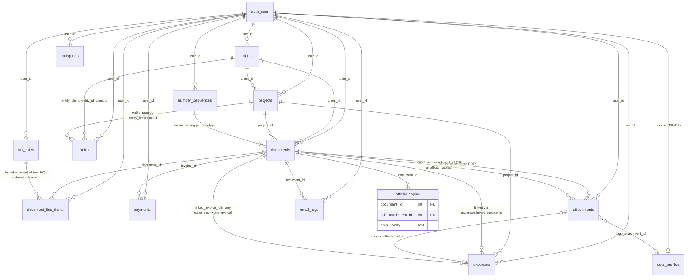

# Lightweight Bookkeeping ERD (PostgreSQL/Supabase)

Note: DATABASE\_SYSTEM = PostgreSQL (Supabase). Types use pg types; Supabase RLS assumed on user\_id for all tenant tables. All monetary values are in USD cents (integer) to avoid floating precision issues; currency fields exist but constrained to 'USD' for future-safe multi-currency.

## 0) High-level ER Diagram

* * *

## 1) Entity Identification

| Entity | Purpose |
| --- | --- |
| user\_profiles | Issuer defaults/branding for a user (name, address, tax ID, logo, default tax rate/terms, numbering defaults). Single row per user. |
| clients | Customer directory entry; billing/contact defaults. |
| projects | Projects under clients with default PO, internal notes, status. |
| documents | Quotes and Invoices with lifecycle statuses, totals, and PDF/email officialization. |
| document\_line\_items | Line items for quotes/invoices with single tax rate per line. |
| payments | Payments recorded against invoices; derive invoice status. |
| expenses | Costs with categories, receipts, billable flags and linkage to invoices. |
| categories | User-defined expense categories. |
| attachments | Binary objects metadata (receipts, PDFs, logos) stored in Cloudflare. |
| email\_logs | Record of outgoing document emails (to/subject/body/provider status). |
| number\_sequences | Per-user counters for quote/invoice numbering with prefix/padding. |
| notes | Internal notes on clients and projects. |
| tax\_rates | Per-user named tax rates with one default. |
| official\_copies | "Official" rendered PDF and email body snapshots for documents (on Send/Finalize). |

* * *

## 2) Attributes (PostgreSQL)

Conventions:

-   id: bigserial primary keys unless stated.
-   user\_id: uuid (FK to auth.users.id in Supabase).
-   All amounts in cents: integer ≥ 0.
-   currency: text constrained to 'USD' for now.
-   Timestamps: timestamptz with defaults where appropriate.

### user\_profiles (1:1 with user)

| Field | Type | Req | Validation/Notes |
| --- | --- | --- | --- |
| user\_id | uuid PK, FK auth.users(id) | Y | one row per user |
| business\_name | text | N | length <= 200 |
| legal\_name | text | N | length <= 200 |
| address\_line1 | text | N | <= 200 |
| address\_line2 | text | N | <= 200 |
| city | text | N | <= 100 |
| region | text | N | <= 100 |
| postal\_code | text | N | <= 20 |
| country | text | N | ISO-3166 alpha-2 recommended |
| tax\_id | text | N | <= 50 |
| logo\_attachment\_id | bigint FK attachments(id) | N | must belong to same user |
| default\_tax\_rate\_id | bigint FK tax\_rates(id) | N | same user |
| default\_payment\_terms\_days | int | N | check 0<=days<=365 |
| numbering\_quote\_prefix | text | N | <= 10 |
| numbering\_invoice\_prefix | text | N | <= 10 |
| numbering\_padding | int | N | 2..10 |
| created\_at | timestamptz | Y | default now() |
| updated\_at | timestamptz | Y | default now() |

### clients

| Field | Type | Req | Validation |
| --- | --- | --- | --- |
| id | bigserial PK | Y |   
 |
| user\_id | uuid FK | Y | RLS scope |
| name | text | Y | 1..200 unique per user |
| email | text | Y | email format |
| billing\_address | jsonb | N | structured address optional |
| tax\_vat\_id | text | N | <= 50 |
| default\_tax\_rate\_id | bigint FK tax\_rates(id) | N | same user |
| default\_payment\_terms\_days | int | N | 0..365 |
| default\_currency | text | N | CHECK = 'USD' |
| archived\_at | timestamptz | N | soft archive |
| created\_at | timestamptz | Y | now() |
| updated\_at | timestamptz | Y | now() |

### projects

| Field | Type | Req | Validation |
| --- | --- | --- | --- |
| id | bigserial PK | Y |   
 |
| user\_id | uuid FK | Y |   
 |
| client\_id | bigint FK clients(id) | Y | same user |
| name | text | Y | 1..200 unique per client (optional constraint) |
| status | text | Y | CHECK IN ('Active','Completed','Archived') |
| default\_po\_number | varchar(50) | N | <= 50 characters |
| notes | text | N |   
 |
| origin\_quote\_id | bigint FK documents(id) | N | type=quote, same user |
| archived\_at | timestamptz | N |   
 |
| created\_at | timestamptz | Y | now() |
| updated\_at | timestamptz | Y | now() |

### documents

| Field | Type | Req | Validation |
| --- | --- | --- | --- |
| id | bigserial PK | Y |   
 |
| user\_id | uuid FK | Y |   
 |
| type | text | Y | CHECK IN ('quote','invoice') |
| number | text | Y | unique per (user\_id,type); not null post-finalization; may be null in draft if desired |
| client\_id | bigint FK clients(id) | Y | same user |
| project\_id | bigint FK projects(id) | N | same user; filtered by client |
| po\_number | varchar(50) | N | <= 50 characters; inherits once from project.default\_po\_number |
| issue\_date | date | N | required for finalized/sent |
| due\_date | date | N | invoices only; computed by terms |
| expiry\_date | date | N | quotes only |
| public\_notes | text | N |   
 |
| internal\_notes | text | N |   
 |
| currency | text | Y | CHECK = 'USD' |
| subtotal\_cents | int | Y | \>=0 |
| tax\_total\_cents | int | Y | \>=0 |
| total\_cents | int | Y | \>=0 |
| amount\_paid\_cents | int | Y | default 0, >=0 |
| balance\_due\_cents | int | Y | computed, >=0 |
| status | text | Y | derived/check: invoice in ('Draft','Sent','Unpaid','Partial','Paid','Void'); quote in ('Draft','Sent','Accepted','Expired') |
| accepted\_at | timestamptz | N | quotes |
| sent\_at | timestamptz | N |   
 |
| finalized\_at | timestamptz | N |   
 |
| archived\_at | timestamptz | N | cannot archive unpaid invoices |
| created\_at | timestamptz | Y | now() |
| updated\_at | timestamptz | Y | now() |

### document\_line\_items

| Field | Type | Req | Validation |
| --- | --- | --- | --- |
| id | bigserial PK | Y |   
 |
| user\_id | uuid FK | Y |   
 |
| document\_id | bigint FK documents(id) | Y | same user |
| position | int | Y | \>=1 |
| description | text | Y | 1..1000 |
| quantity | numeric(12,4) | Y | \>=0 |
| unit | varchar(20) | N | free text: hours/each/etc <= 20 |
| unit\_price\_cents | int | Y | \>=0 |
| line\_subtotal\_cents | int | Y | quantity\*unit\_price (rounded) |
| tax\_rate\_percent | numeric(7,4) | N | 0..100; single rate per line |
| tax\_amount\_cents | int | Y | \>=0 |
| line\_total\_cents | int | Y | subtotal+tax |
| created\_at | timestamptz | Y | now() |
| updated\_at | timestamptz | Y | now() |

### payments

| Field | Type | Req | Validation |
| --- | --- | --- | --- |
| id | bigserial PK | Y |   
 |
| user\_id | uuid FK | Y |   
 |
| invoice\_id | bigint FK documents(id) | Y | must be type='invoice' & same user |
| date | date | Y |   
 |
| amount\_cents | int | Y | \>0 |
| method | varchar(50) | N | <= 50 (e.g., ACH, Card, Cash, Check) |
| reference | varchar(100) | N | <= 100 |
| created\_at | timestamptz | Y | now() |

### expenses

| Field | Type | Req | Validation |
| --- | --- | --- | --- |
| id | bigserial PK | Y |   
 |
| user\_id | uuid FK | Y |   
 |
| date | date | Y |   
 |
| vendor | varchar(200) | N | <= 200 |
| category\_id | bigint FK categories(id) | N | same user |
| project\_id | bigint FK projects(id) | N | same user |
| total\_amount\_cents | int | Y | \>=0 |
| tax\_amount\_cents | int | Y | \>=0, <= total |
| currency | text | Y | CHECK = 'USD' |
| receipt\_attachment\_id | bigint FK attachments(id) | N | same user |
| notes | text | N |   
 |
| billable | boolean | Y | default false |
| billing\_status | text | Y | CHECK IN ('unbilled','billed','user\_paid') |
| linked\_invoice\_id | bigint FK documents(id) | N | Must be type='invoice' & same user; required when billing\_status='billed' |
| created\_at | timestamptz | Y | now() |
| updated\_at | timestamptz | Y | now() |

### categories

| Field | Type | Req | Validation |
| --- | --- | --- | --- |
| id | bigserial PK | Y |   
 |
| user\_id | uuid FK | Y |   
 |
| name | varchar(100) | Y | unique per user; <= 100 |
| description | text | N |   
 |
| created\_at | timestamptz | Y | now() |

### attachments

| Field | Type | Req | Validation |
| --- | --- | --- | --- |
| id | bigserial PK | Y |   
 |
| user\_id | uuid FK | Y |   
 |
| bucket | text | Y | e.g., 'receipts','pdfs','logos' |
| path | text | Y | unique per user per bucket |
| mime\_type | text | Y |   
 |
| size\_bytes | int | Y | \>=0 |
| sha256 | text | N | hex(64) |
| created\_at | timestamptz | Y | now() |

### email\_logs

| Field | Type | Req | Validation |
| --- | --- | --- | --- |
| id | bigserial PK | Y |   
 |
| user\_id | uuid FK | Y |   
 |
| document\_id | bigint FK documents(id) | Y | same user |
| to\_email | text | Y | email format |
| subject | varchar(200) | Y | <= 200 |
| body | text | Y | snapshot of body |
| status | text | Y | 'queued','sent','failed' |
| provider\_message\_id | varchar(200) | N | <= 200 |
| sent\_at | timestamptz | N | set when sent |
| created\_at | timestamptz | Y | now() |

### number\_sequences

| Field | Type | Req | Validation |
| --- | --- | --- | --- |
| id | bigserial PK | Y |   
 |
| user\_id | uuid FK | Y |   
 |
| type | text | Y | CHECK IN ('quote','invoice') |
| prefix | varchar(10) | Y | <= 10 |
| current\_value | int | Y | \>=0 |
| padding | int | Y | 2..10 |
| created\_at | timestamptz | Y | now() |
| updated\_at | timestamptz | Y | now() |
| UNIQUE(user\_id, type) |   
 |   
 | one sequence per type per user |

### notes

| Field | Type | Req | Validation |
| --- | --- | --- | --- |
| id | bigserial PK | Y |   
 |
| user\_id | uuid FK | Y |   
 |
| entity | text | Y | CHECK IN ('client','project') |
| entity\_id | bigint | Y | FK to clients/projects with same user |
| body | text | Y |   
 |
| created\_at | timestamptz | Y | now() |

### tax\_rates

| Field | Type | Req | Validation |
| --- | --- | --- | --- |
| id | bigserial PK | Y |   
 |
| user\_id | uuid FK | Y |   
 |
| name | varchar(50) | Y | <= 50; unique per user |
| rate\_percent | numeric(7,4) | Y | 0..100 |
| is\_default | boolean | Y | default false; at most one true per user |
| created\_at | timestamptz | Y | now() |

### official\_copies

| Field | Type | Req | Validation |
| --- | --- | --- | --- |
| id | bigserial PK | Y |   
 |
| user\_id | uuid FK | Y |   
 |
| document\_id | bigint FK documents(id) | Y | same user; unique (latest or one-per-event if you prefer multiple) |
| pdf\_attachment\_id | bigint FK attachments(id) | Y | same user |
| email\_body | text | Y | templated body snapshot |
| created\_at | timestamptz | Y | now() |

Optional: If you need multiple official copies (e.g., Send vs Finalize), add event\_type text CHECK IN ('send','finalize') and make UNIQUE(user\_id, document\_id, event\_type).

* * *

## 3) Relationships

-   user\_profiles 1–1 auth.users
    -   PK/FK: user\_profiles.user\_id → auth.users.id
-   clients N–1 users
    -   clients.user\_id → users.id
-   projects N–1 clients; projects N–1 users
    -   projects.client\_id → clients.id; projects.user\_id → users.id
-   documents N–1 clients; optional N–1 projects; N–1 users
    -   documents.client\_id → clients.id; documents.project\_id → projects.id; documents.user\_id → users.id
-   document\_line\_items N–1 documents; N–1 users
    -   document\_line\_items.document\_id → documents.id; user\_id
-   payments N–1 documents (invoice only); N–1 users
    -   payments.invoice\_id → documents.id (CHECK documents.type='invoice'); user\_id
-   expenses N–1 projects (optional); N–1 categories (optional); N–1 documents (optional link to invoice); N–1 users
    -   project\_id → projects.id; category\_id → categories.id; linked\_invoice\_id → documents.id (type='invoice'); user\_id
-   categories N–1 users
-   attachments N–1 users
-   email\_logs N–1 documents; N–1 users
-   number\_sequences N–1 users (unique per type)
-   notes N–1 clients or projects via entity/entity\_id; N–1 users
-   tax\_rates N–1 users; referenced by user\_profiles.default\_tax\_rate\_id and clients.default\_tax\_rate\_id
-   official\_copies N–1 documents; N–1 attachments; N–1 users

Cardinalities summary:

-   User → Clients/Projects/Documents/Expenses/etc: 1-to-many
-   Client → Projects/Documents: 1-to-many
-   Project → Documents/Expenses: 1-to-many
-   Document → LineItems/Payments/EmailLogs/OfficialCopies: 1-to-many
-   Invoice (Document type=invoice) ← Expenses: many expenses can link to one invoice
-   No many-to-many junctions required in current scope.

* * *

## 4) Constraints

Unique constraints:

-   clients: UNIQUE(user\_id, name)
-   projects: OPTIONAL UNIQUE(user\_id, client\_id, name)
-   documents: UNIQUE(user\_id, type, number) (apply when number is not null)
-   categories: UNIQUE(user\_id, name)
-   tax\_rates: UNIQUE(user\_id, name); partial unique on is\_default true per user (see check)
-   number\_sequences: UNIQUE(user\_id, type)
-   attachments: UNIQUE(user\_id, bucket, path)
-   official\_copies: UNIQUE(user\_id, document\_id) or (user\_id, document\_id, event\_type) if multi-event

Check constraints:

-   documents.type IN ('quote','invoice')
-   documents.currency = 'USD'
-   documents.status constrained by type:
    -   For invoices: IN ('Draft','Sent','Unpaid','Partial','Paid','Void')
    -   For quotes: IN ('Draft','Sent','Accepted','Expired')
-   documents: amount\_paid\_cents >= 0; subtotal\_cents>=0; tax\_total\_cents>=0; total\_cents>=0; balance\_due\_cents>=0
-   document\_line\_items: tax\_rate\_percent BETWEEN 0 AND 100
-   payments.amount\_cents > 0
-   expenses.currency = 'USD'
-   expenses.billing\_status IN ('unbilled','billed','user\_paid')
-   projects.status IN ('Active','Completed','Archived')
-   tax\_rates.rate\_percent BETWEEN 0 AND 100
-   tax\_rates: Enforce single default via partial unique index UNIQUE(user\_id) WHERE is\_default = true
-   Prevent archiving unpaid invoices: documents.archived\_at IS NULL OR (type='invoice' AND status IN ('Paid','Void'))

Foreign key constraints (same-user guard):

-   Application-level or trigger-level verification that foreign rows share same user\_id. In PostgreSQL, enforce by:
    -   RLS policies and/or composite FKs via deferrable constraint triggers that compare user\_id equality.

Derived fields and triggers:

-   documents.amount\_paid\_cents and balance\_due\_cents materialized and updated on payment insert/update/delete.
-   documents.status derivation:
    -   invoice: sum payments vs total -> Unpaid/Partial/Paid; 'Sent' when sent\_at set and no payments; allow 'Void' via explicit action
    -   quote: Expired if now()>expiry\_date and not accepted; Accepted when accepted\_at set
-   PO inheritance: before insert on documents when project\_id is set and po\_number is null, copy from projects.default\_po\_number.
-   expenses.billing\_status and linked\_invoice\_id synchronized by "Add to Invoice" workflow trigger.
-   Official copies creation on Send/Finalize with snapshot of PDF and email body.

Default values:

-   amount\_paid\_cents default 0
-   balance\_due\_cents default total\_cents - amount\_paid\_cents (ensure trigger keeps in sync)
-   expenses.billable default false; billing\_status default 'unbilled'
-   documents.currency default 'USD'; expenses.currency default 'USD'
-   timestamps default now()
-   number\_sequences.padding default e.g., 4 (if not set in profile)

* * *

## 5) Indexes

General:

-   All PKs implicit btree.
-   All FKs get indexes on child columns.

Specific indexes and rationale:

-   clients(user\_id, name) UNIQUE: fast lookup, prevent dupes.
-   projects(user\_id, client\_id): filter by client; plus (user\_id, client\_id, status) for dashboard/project lists.
-   documents:
    -   (user\_id, type, number) UNIQUE: number lookup and collision prevention.
    -   (user\_id, client\_id, type, status): Hub filters.
    -   (user\_id, project\_id, type): project dashboards.
    -   (user\_id, issue\_date), (user\_id, due\_date), (user\_id, expiry\_date): reporting and AR/expiry queries.
    -   Partial index for AR: CREATE INDEX ON documents (due\_date) WHERE type='invoice' AND status IN ('Unpaid','Partial');
-   document\_line\_items(document\_id): typical join; plus (user\_id, document\_id, position).
-   payments(invoice\_id, date): recompute and reporting by period; also (user\_id, date).
-   expenses:
    -   (user\_id, project\_id, date): project profitability.
    -   (user\_id, billing\_status, project\_id): "Add to Invoice" workflow filters.
    -   (user\_id, linked\_invoice\_id): fetch expenses attached to invoice.
    -   (user\_id, category\_id, date): category reports.
-   categories(user\_id, name) UNIQUE
-   email\_logs(document\_id), plus (user\_id, created\_at DESC) for recent activity.
-   number\_sequences(user\_id, type) UNIQUE
-   tax\_rates(user\_id, is\_default) WHERE is\_default = true UNIQUE (partial)
-   attachments(user\_id, bucket, path) UNIQUE
-   official\_copies(document\_id) UNIQUE or (document\_id, event\_type) UNIQUE if multi-event.

* * *

## 6) Normalization

3NF compliance:

-   Each table has atomic attributes; no repeating groups.
-   Non-key attributes depend on the key, the whole key, and nothing but the key.
-   Totals and derived amounts in documents are intentionally materialized for performance—this is denormalization by design with triggers ensuring consistency.
-   document\_line\_items store tax\_rate\_percent snapshot (not FK) to maintain historical accuracy; tax rate identity could be recorded via optional tax\_rate\_id if desired, but not necessary.

Intentional denormalizations:

-   documents.materialized totals (subtotal\_cents, tax\_total\_cents, total\_cents, amount\_paid\_cents, balance\_due\_cents) for fast reads/reporting.
-   document\_line\_items store computed line\_subtotal\_cents, tax\_amount\_cents, line\_total\_cents to avoid runtime calculations and preserve historical values even if tax logic changes later.
-   email\_logs and official\_copies store full email body snapshot to preserve legal/communication history.
-   currency fields fixed to 'USD' but present for future multi-currency; check constraints lock the value for now.

* * *

## 7) RLS & Security (summary)

-   Every row has user\_id; RLS policies: USING (user\_id = auth.uid()) and WITH CHECK (user\_id = auth.uid()).
-   Attachments bucket/path namespacing per user; enforce via RLS and storage rules.
-   Ensure cross-entity FKs share same user via constraints or deferred check triggers.

* * *

## 8) Additional Implementation Notes

-   Number assignment: safe, gap-tolerant sequence using number\_sequences with SELECT FOR UPDATE to increment current\_value atomically, then format number = prefix || lpad(nextval, padding, '0').
-   Status transitions: enforce via functions:
    -   invoice\_status(document): derive from payments; allow 'Sent' flag when sent\_at set and no payments; 'Void' only via explicit action and balance\_due\_cents must be 0.
    -   quote\_expiry: periodic job or view flags expired when expiry\_date < current\_date and accepted\_at is null; optionally materialize via trigger.
-   Official copies: upon Send/Finalize, render PDF to attachments, insert official\_copies with email\_body. On re-render, if data changed since official copy, return warning and link.