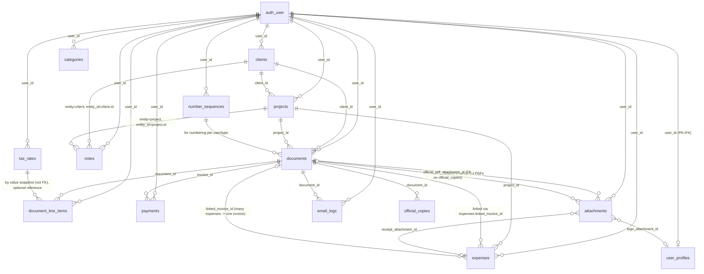

Convert this ERD to SQL schema for PostgreSQL/Supabase:



## SYSTEM CONTEXT AND REQUIREMENTS

### Application Context
- **Target**: Lightweight bookkeeping system for independent consultants (<50 clients)
- **Architecture**: Modular monolith with Supabase PostgreSQL + RLS
- **Backend Language**: Fastify (Node.js/TypeScript)
- **Tenancy Model**: Single-user per tenant with strict user_id isolation
- **Scale**: Small business focus (<50 clients per user)
- **Currency**: USD only (currency fields exist but constrained to 'USD' for future expansion)

### Database System Specifications
- **Database**: PostgreSQL via Supabase
- **Multi-tenancy**: Row Level Security (RLS) on all tables using user_id
- **Auth Integration**: Supabase Auth with auth.users table
- **Storage**: Cloudflare Storage for attachments (receipts, PDFs, logos)
- **Character Encoding**: UTF-8
- **Timezone**: All timestamps in UTC with timestamptz

## CORE REQUIREMENTS

### 1. Use proper data types for PostgreSQL/Supabase
- Primary keys: bigserial (auto-incrementing)
- User references: uuid (foreign key to auth.users.id)
- Monetary values: integer (cents, never use floating point)
- Currency: text with CHECK constraint = 'USD'
- Timestamps: timestamptz with default now()
- Text limits: varchar with length constraints where specified
- Structured data: jsonb for addresses, configurations

### 2. Include all constraints and validations
**Field Validations**:
- Email fields: valid email format
- Names: length constraints as specified (1-200 chars typical)
- Amounts: >= 0 integer checks
- Percentages: 0-100 numeric(7,4) precision
- Status fields: CHECK IN (enum values)
- Dates: proper date types with business logic validation

**Unique Constraints**:
- clients: UNIQUE(user_id, name)
- projects: OPTIONAL UNIQUE(user_id, client_id, name)
- documents: UNIQUE(user_id, type, number) (when number not null)
- categories: UNIQUE(user_id, name)
- tax_rates: UNIQUE(user_id, name); partial unique on is_default=true per user
- number_sequences: UNIQUE(user_id, type)
- attachments: UNIQUE(user_id, bucket, path)
- official_copies: UNIQUE(user_id, document_id)

**Foreign Key Constraints**:
- All foreign keys must reference same user_id (cross-user data isolation)
- Deferrable constraints for complex insertions
- Application-level verification or triggers for same-user FK enforcement

### 3. Add indexes for performance
**Essential Indexes**:
- All PKs (implicit)
- All FK columns (automatic + explicit for clarity)
- clients(user_id, name) UNIQUE
- projects(user_id, client_id, status)
- documents(user_id, type, number) UNIQUE
- documents(user_id, client_id, type, status)
- documents(user_id, project_id, type)
- documents(user_id, issue_date), (user_id, due_date), (user_id, expiry_date)
- Partial index for AR: CREATE INDEX ON documents (due_date) WHERE type='invoice' AND status IN ('Unpaid','Partial')
- document_line_items(document_id, position)
- payments(invoice_id, date)
- expenses(user_id, project_id, date)
- expenses(user_id, billing_status, project_id)
- expenses(user_id, category_id, date)
- categories(user_id, name) UNIQUE
- email_logs(document_id), (user_id, created_at DESC)
- number_sequences(user_id, type) UNIQUE
- tax_rates(user_id, is_default) WHERE is_default = true (partial unique)

### 4. Include timestamps (created_at, updated_at)
- All tables: created_at timestamptz NOT NULL DEFAULT now()
- Most tables: updated_at timestamptz NOT NULL DEFAULT now()
- Soft delete fields: archived_at timestamptz NULLABLE
- Event timestamps: sent_at, accepted_at, finalized_at, etc.

### 5. Add soft delete support where appropriate
- archived_at timestamptz for: clients, projects, documents
- Prevent archiving unpaid invoices (status must be 'Paid' or 'Void')
- Query patterns should filter WHERE archived_at IS NULL by default
- Include indexes on archived_at for efficient filtering

### 6. Generate seed data script with realistic test data
**Minimum 3 examples per entity**:
- User profiles with realistic business information
- Clients with varied industries and billing terms
- Projects with different statuses and PO numbers
- Documents covering all status types and document types
- Line items with realistic services and tax calculations
- Payments with various methods and reference numbers
- Expenses with different categories and receipt attachments
- Categories relevant to consulting business
- Email logs with proper status tracking
- Number sequences for both quotes and invoices
- Notes for clients and projects
- Tax rates including a default rate
- Attachments representing different file types

## ENTITY SPECIFICATIONS

### user_profiles (1:1 with auth.users)
- Fields: user_id (PK/FK), business_name, legal_name, address fields, tax_id, logo_attachment_id, default_tax_rate_id, default_payment_terms_days, numbering prefixes/padding
- Constraints: one row per user, length limits on text fields
- Business logic: defaults for documents and clients

### clients
- Fields: name, email, billing_address(jsonb), tax_vat_id, default_tax_rate_id, default_payment_terms_days
- Constraints: unique name per user, email format validation
- Business logic: defaults cascade to documents

### projects
- Fields: client_id, name, status ('Active','Completed','Archived'), default_po_number, notes, origin_quote_id
- Constraints: status enum, project names unique per client (optional)
- Business logic: inherit client defaults, quote-to-invoice workflow

### documents
- Types: 'quote' or 'invoice'
- Fields: number (unique per user/type), client_id, project_id (optional), dates, monetary totals, status
- Status enums: 
  - Invoice: 'Draft','Sent','Unpaid','Partial','Paid','Void'
  - Quote: 'Draft','Sent','Accepted','Expired'
- Business logic: derived status from payments, materialized totals, PO inheritance

### document_line_items
- Fields: document_id, position, description, quantity, unit, unit_price_cents, tax_rate_percent, calculated totals
- Constraints: position >= 1, positive amounts, tax snapshot storage
- Business logic: preserve historical tax rates, compute line totals

### payments
- Fields: invoice_id, date, amount_cents, method, reference
- Constraints: positive amounts only, invoice type validation
- Business logic: update document paid amounts and status

### expenses
- Fields: date, vendor, category_id, project_id, total_amount_cents, tax_amount_cents, billable, billing_status, linked_invoice_id
- Status: 'unbilled','billed','user_paid'
- Business logic: project profitability tracking, invoice linking

### categories
- Fields: name, description
- Constraints: unique name per user
- Purpose: expense categorization for reporting

### attachments
- Fields: bucket, path, mime_type, size_bytes, sha256
- Constraints: unique path per user/bucket, file size validation
- Buckets: 'receipts','pdfs','logos'
- Integration: Cloudflare Storage reference

### email_logs
- Fields: document_id, to_email, subject, body, status, provider_message_id, sent_at
- Status: 'queued','sent','failed'
- Purpose: legal/communication history preservation

### number_sequences
- Fields: type, prefix, current_value, padding
- Constraints: unique per user/type, padding 2-10
- Purpose: gap-tolerant document numbering

### notes
- Fields: entity ('client','project'), entity_id, body
- Purpose: internal notes on business entities

### tax_rates
- Fields: name, rate_percent, is_default
- Constraints: unique name per user, single default via partial unique index
- Purpose: configurable tax rates with default selection

### official_copies
- Fields: document_id, pdf_attachment_id, email_body
- Purpose: immutable snapshots of sent/finalized documents
- Constraint: unique per document (latest copy)

## DERIVED FIELDS AND TRIGGERS

### Materialized Computations
- documents.amount_paid_cents: SUM(payments.amount_cents)
- documents.balance_due_cents: total_cents - amount_paid_cents
- document_line_items.line_subtotal_cents: quantity * unit_price_cents
- document_line_items.tax_amount_cents: line_subtotal_cents * (tax_rate_percent/100)
- document_line_items.line_total_cents: line_subtotal_cents + tax_amount_cents

### Status Derivation Logic
- Invoice status: Based on payments vs total
- Quote expiry: Check expiry_date vs current_date
- PO inheritance: Copy project.default_po_number when null

### Data Integrity Triggers
- Prevent archiving unpaid invoices
- Sync expense billing_status with linked_invoice_id
- Update document totals on line item changes
- Maintain number sequence increments

## ROW LEVEL SECURITY (RLS)

### Policies Required
```sql
-- All tables need these base policies:
CREATE POLICY "Users can view own data" ON table_name
    FOR SELECT USING (user_id = auth.uid());

CREATE POLICY "Users can insert own data" ON table_name
    FOR INSERT WITH CHECK (user_id = auth.uid());

CREATE POLICY "Users can update own data" ON table_name
    FOR UPDATE USING (user_id = auth.uid())
    WITH CHECK (user_id = auth.uid());

CREATE POLICY "Users can delete own data" ON table_name
    FOR DELETE USING (user_id = auth.uid());
```

### Storage Policies
- attachments bucket/path namespacing per user
- File access restrictions based on user ownership

## MIGRATION STRATEGY

### Phase 1: Core Schema
1. Create base tables without constraints
2. Add primary keys and basic indexes
3. Implement RLS policies
4. Test user isolation

### Phase 2: Constraints and Triggers
1. Add foreign key constraints (deferrable where needed)
2. Implement unique constraints
3. Add check constraints and validations
4. Create triggers for derived fields

### Phase 3: Performance Optimization
1. Create performance indexes
2. Implement partial indexes for common queries
3. Add composite indexes for dashboard queries
4. Optimize for AR reporting patterns

### Phase 4: Advanced Features
1. Implement number sequences with gap tolerance
2. Add official copy management
3. Create email logging infrastructure
4. Deploy with real data testing

## ROLLBACK PROCEDURES

### Pre-deployment Safeguards
- Full database backup before migration
- Migration script with transaction wrapping
- Dry-run mode for testing
- Rollback script ready for each phase

### Rollback Triggers
- Migration failure detection
- Automatic rollback on constraint violations
- Data integrity verification post-migration
- Performance baseline comparison

### Recovery Procedures
- Point-in-time restore capability
- Selective table rollback options
- User data preservation priority
- Minimal downtime rollback process

## IMPLEMENTATION NOTES

### Number Assignment
- Atomic sequence increment using SELECT FOR UPDATE
- Gap-tolerant numbering with prefix/padding
- Collision detection and resolution

### Status Management
- Status transition validation functions
- Prevent invalid status changes
- Audit trail for status modifications

### PDF Generation Integration
- Official copy creation on Send/Finalize
- PDF storage in attachments with proper metadata
- Email body snapshot preservation

### Data Consistency
- Cross-user FK enforcement via triggers
- Materialized view options for reporting
- Cache invalidation strategies

Use {{BACKEND_LANGUAGE}} (Node.js/TypeScript with Fastify) syntax for the implementation. Generate Supabase-compatible SQL with proper RLS policies and migrations format.