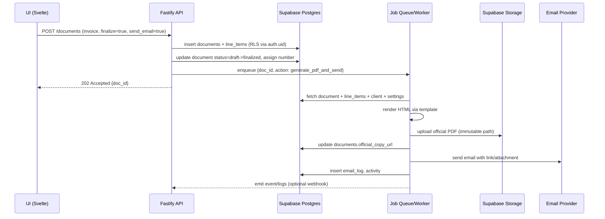

# Lightweight Bookkeeping App — System Architecture

Below is a pragmatic, low-ops architecture tailored for a lean startup, prioritizing simplicity, cost-efficiency, and reliability while supporting future growth.

---

## 1) Architecture Pattern

- Recommended: Modular monolith with serverless adjuncts
  - Frontend: Astro/Svelte SPA/MPA served statically via Cloudflare Pages
  - Backend: Single Fastify app (modular structure) deployed on Railway
  - Database: Supabase (PostgreSQL with RLS)
  - Background tasks: Serverless/queue-based jobs for PDF/email on Supabase/Edge Functions or a lightweight worker on Railway (cron)

Why this choice:
- Scope and scale (<50 clients) don't justify microservices overhead.
- Monolith = fewer moving parts, easier deployments and debugging, better speed of iteration.
- Supabase provides auth, RLS, storage, and Postgres with good DX.
- Serverless functions/worker only where async helps: PDF rendering, email sending, scheduled reports.

---

## 2) Component Diagram

```mermaid
flowchart LR
  subgraph Client["Client (Browser)"]
    UI[Astro/Svelte UI]
  end

  subgraph CF["Cloudflare"]
    CFPages[Cloudflare Pages (Static Assets, Edge Cache)]
  end

  subgraph API["Railway"]
    FAPI[Fastify API (Modular Monolith)]
    BJ[Background Worker (optional)]
  end

  subgraph Supabase["Supabase"]
    SBAuth[Auth]
    SBPostgres[(PostgreSQL + RLS)]
    SBStorage[(Storage: receipts, PDFs)]
    SBFunctions[Edge Functions (optional)]
  end

  subgraph Ext["External Services"]
    Email[Email Provider (Postmark/SES)]
    PDF[Headless Chromium (Puppeteer) or Cloud Render]
    CDN[(CDN - via Cloudflare)]
    Logs[Log Sink (Railway logs, Supabase logs)]
    Metrics[Metrics (Railway, Supabase, Uptime)]
  end

  UI -- Static Files --> CFPages
  UI -- HTTPS / REST/JSON --> FAPI
  UI -- Direct Uploads --> SBStorage

  FAPI -- Supabase JS/SQL --> SBPostgres
  FAPI -- Verify JWT --> SBAuth
  FAPI -- Signed URLs --> SBStorage
  FAPI -- Webhooks --> BJ
  FAPI -- Emails --> Email
  FAPI -- PDF Jobs --> PDF

  BJ -- Scheduled/Queue --> SBFunctions
  BJ -- Storage (write official copies) --> SBStorage
  BJ -- DB updates --> SBPostgres

  CFPages -- CDN --> Client
  FAPI -- Logs --> Logs
  FAPI -- Metrics --> Metrics
  Supabase -- Metrics/Logs --> Metrics
```

Major components:
- Astro/Svelte frontend: UI, routing, client-side interactivity.
- Fastify API: Auth validation, business logic, PDF/email orchestration, reporting aggregation.
- Supabase:
  - Auth (JWT) for RLS.
  - Postgres for transactional data.
  - Storage for attachments and official PDFs.
  - Edge Functions for cron or lightweight async tasks if desired.
- Background processing: Railway worker or Supabase Functions for PDF/email.
- External services: Email provider, headless rendering (if not bundled), Cloudflare CDN.

---

## 3) Data Flow

Key flows:

1) Authentication
- User logs in via Supabase Auth (email/password or OAuth).
- Frontend stores JWT and sends it with API requests.
- Fastify verifies JWT via Supabase public key. DB access enforces RLS by user_id = auth.uid().

2) Dashboard snapshot
- UI → Fastify: GET /dashboard
- Fastify → Postgres: aggregate queries (AR, net profit, recent activity)
- Fastify returns summarized JSON. Caches for short TTL (see Caching).

3) Transaction Hub: Create Quote → Convert to Invoice → Payments
- Create Quote:
  - UI → Fastify: POST /documents (type=quote, client_id, project_id, line_items, taxes)
  - Fastify validates, inserts into documents + line_items with user_id from JWT.
  - If send_email=true, enqueue email + PDF generation job.
- Convert Quote → Invoice:
  - UI → Fastify: POST /documents/:id/convert?to=invoice
  - Fastify reads quote, clones to invoice with status=draft, preserves client/project, inherits PO if project default exists.
  - Optionally creates project from quote (Quote→Project) if requested.
- Payments:
  - UI → Fastify: POST /payments (document_id, amount_cents, date, method)
  - Fastify inserts payment, updates document balance (sum line_items - sum payments).
  - Multiple payments supported; statuses update based on balance (partial/paid).

4) Expense Manager
- Quick add expense:
  - UI → Fastify: POST /expenses (amount_cents, category_id, project_id, billable flags, receipt file ref)
  - Optional direct upload: UI → Supabase Storage with signed URL; store reference in expense.
- Add to invoice workflow:
  - UI selects expenses → Fastify aggregates into new invoice line items; marks expenses billed or links to invoice_id.

5) Client/Project Management
- Client creation inline:
  - UI → Fastify: POST /clients (tax/VAT, payment terms, defaults)
- Projects under client:
  - UI → Fastify: POST /projects (status, default_PO, internal_notes)
- Project dashboard pulls documents, expenses, profitability via aggregate queries.

6) Reporting Center
- UI → Fastify: GET /reports?type=PnL&from=...&to=...
- Fastify runs parameterized SQL; may use materialized views for heavy reports.
- Exports:
  - CSV: Fastify streams.
  - PDF: enqueue job, write official copy to Storage, return signed URL.

7) Attachments and PDFs
- UI requests signed URL → uploads to Storage directly.
- Fastify stores metadata in attachments table referencing entity_id.
- Official copies (final invoices) stored in Storage with immutable path; metadata recorded.

Potential bottlenecks and mitigations:
- Aggregation-heavy reports: add indexes on user_id, date, type, project_id; materialized views or cached snapshots.
- PDF generation bursts: queue jobs; rate-limit/serialize per user; ephemeral compute (Supabase Functions/Railway worker).
- N+1 queries for lists: use joins and aggregate queries; server-side pagination and filters.

---

## 4) Scalability Strategy

Target: <50 clients, low traffic.

- Vertical first: one small Railway service for Fastify is sufficient. Scale up a single dyno/container if needed.
- Horizontal readiness:
  - Fastify stateless; can run multiple instances behind Railway's router if needed.
  - Supabase scales managed. Add read replicas if reporting grows (overkill likely).
- Components to scale:
  - Fastify API horizontally if CPU-bound (PDF orchestration offloaded).
  - Background worker horizontally for PDF/email queue.
- Caching:
  - HTTP caching via Cloudflare for static assets.
  - API response caching (short TTL 30–120s) for dashboard and lists using in-memory LRU in Fastify or a tiny Upstash/Redis if necessary (probably not).
  - ETags/If-None-Match for list endpoints.
  - Precompute summary fields on write where useful (document balance, totals).
- Database:
  - Use integer cents and numeric for tax rates; indexes for common filters:
    - documents(user_id, type, status, client_id, project_id, issued_at)
    - payments(user_id, document_id, paid_at)
    - expenses(user_id, project_id, category_id, billable_state, incurred_at)
    - projects(user_id, client_id, status)
  - Partitioning not needed at this scale.

---

## 5) Infrastructure

Hosting
- Frontend (Astro/Svelte): Cloudflare Pages
  - Benefits: global CDN, automatic builds, preview deployments, zero-cost tier generous.
- Backend (Fastify): Railway
  - Simple Dockerfile or Nixpacks deployment, environment variables, one-click Postgres proxy if needed (but use Supabase DB URL).
  - Autosleep optional for cost; keep-alive pings if desired.

Database with Supabase
- Use Supabase managed Postgres with:
  - RLS policies: user_id = auth.uid() on all tables.
  - Postgres extensions: pgcrypto (ids), pg_stat_statements (performance), plv8 optional.
  - Supabase Storage for receipts and PDFs; signed URLs with expirations.
  - Auth: email/password OTP; JWT used by backend.
  - Edge Functions optional for cron (monthly statements) and webhooks.

CDN
- Cloudflare handles static assets and cache for SSR-less pages.
- For file downloads (official PDFs), use Supabase Storage public/signed URLs; optionally route via Cloudflare if using a custom domain with cache rules for immutable copies.

Background jobs
- Option A (simplest): Railway worker process (same repo) using a job queue (e.g., BullMQ with Upstash/Redis) or an internal lightweight queue (database-backed "jobs" table with advisory locks).
- Option B: Supabase Edge Functions triggered by DB insert (e.g., new document finalized → generate PDF → upload to Storage → update documents.official_copy_url).
- PDF generation: Puppeteer/Playwright in worker (Chromium) or external render API. For reliability, generate in the worker with a small queue.

Email sending
- Use Postmark/SendGrid/SES. Templates stored in provider or local MJML templates. Worker composes and sends; store email_log.

Backups and migrations
- Supabase automated backups; also nightly SQL dump into Storage.
- Schema migrations: drizzle/Prisma/Kysely migrations run from CI/CD.

---

## 6) Monitoring & Observability

Metrics to track
- App/API:
  - Request rate, latency (p50/p95/p99), error rate by route.
  - Job queue depth, job duration, failures.
- Business KPIs:
  - Invoices sent, payments recorded, AR total, PDF success/failure rates.
- Database:
  - Query latency, slow query log, locks, connections, CPU/IO.
- Infrastructure:
  - CPU/memory of Fastify and worker, disk usage, 5xx rate.

Alerting
- Uptime monitoring on API and critical endpoints (health, dashboard).
- Alerts on:
  - API error rate >2% sustained 5m.
  - p95 latency >1s sustained 5m.
  - Job failures > N in 10m, queue depth above threshold.
  - DB CPU/connection saturation.
- Delivery: Slack/Email via Railway/Supabase integrations or Healthchecks.io.

Logging
- Structured JSON logs from Fastify (pino) including request_id and user_id (hashed).
- Correlation IDs: generate per-request; pass to worker jobs and email/PDF logs.
- Store in Railway logs; optional sink to Logtail/Datadog/BetterStack for search/retention.
- Supabase has DB and Storage logs; review slow queries and RLS violations.

---

## Reference: API Modules (within the monolith)

- Auth: session validation, token refresh.
- Clients: CRUD, search, defaults, tax/VAT, payment terms.
- Projects: CRUD, status, default PO, dashboards.
- Documents: quotes/invoices/payments linkages, statuses, line items, numbering prefixes, conversions, templated email send, PDF.
- Payments: creation, reconciliation, multi-payment handling.
- Expenses: quick add, categories, receipt flows, billable flags, invoice-attach.
- Reporting: P&L, AR aging, Project Profitability, Balance Sheet; CSV/PDF export.
- Settings: user profile, business defaults, tax rates, prefixes, email templates, archive/export/import.
- Attachments/Notes: storage references, inline notes.

---

## Mermaid: High-Level Sequence for "Send Invoice PDF"



---

## Data Model Notes (aligned to your schema)

- All tables include user_id and RLS: user_id = auth.uid()
- Monetary:
  - amount_cents INT, currency default USD (if multi-currency later, add currency_code).
  - tax_rates as decimal(6,4) or integer basis points.
- Status enums:
  - documents.type: quote|invoice|payment_request
  - documents.status: draft|sent|partial|paid|void
  - projects.status: active|completed|archived
  - expenses.bill_state: billable|unbilled|billed|user_paid
- Activity log table for audit trail (entity, entity_id, action, metadata).

---

## Caching Details

- Cloudflare: cache static, hashed assets; cache control headers set by Pages.
- API:
  - GET /dashboard: cache in-memory 60s per user_id.
  - GET list endpoints with filters: support ETag and conditional requests; optional 30s cache.
- Precompute document balances and totals at write-time to avoid heavy reads.

---

## Security

- RLS enforced on every table; use policies that also restrict updates/deletes to matching user_id.
- Use Supabase JWT verification in Fastify; deny requests without valid token.
- Signed URLs for Storage; official copies can be public-read with immutable path if needed.
- Input validation using zod/typebox; output filtering to avoid overfetch.
- Rate limit per IP/user for sensitive endpoints (email send, PDF generate).

---

## Deployment Footprint

- Cloudflare Pages: build Astro, deploy static.
- Railway:
  - Service 1: Fastify API (Dockerfile/Nixpacks)
  - Service 2 (optional): Worker (same image with different cmd)
- Supabase: managed project (Auth, DB, Storage, Functions)
- Secrets: managed in Railway and Supabase; no secrets in repo.
- CI/CD: GitHub Actions to run tests, migrations, deploy Pages and Railway.

This setup delivers a robust, low-cost, and maintainable system that's easy to evolve as your feature set and user base grow.